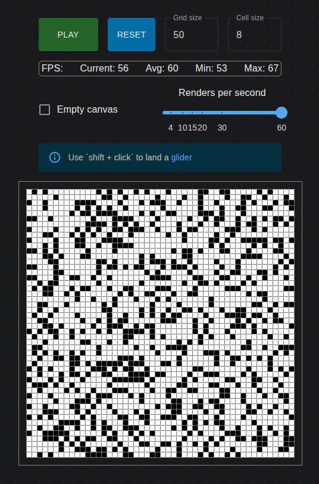

  <h1><code>wasm-game-of-life</code></h1>Built with 🦀🕸⚛️

## Overview

___
This is an implementation of [Conway's Game of Life](https://en.wikipedia.org/wiki/Conway%27s_Game_of_Life) in Rust and
WebAssembly.

## Credits

___
Based on [Rust and WebAssembly](https://rustwasm.github.io/docs/book/introduction.html)
book's [tutorial](https://rustwasm.github.io/docs/book/game-of-life/introduction.html).

## Stack

___

- [wasm-pack](https://rustwasm.github.io/)
- [Webpack](https://webpack.js.org/)
- [React](https://react.dev/)
- [Typescript](https://www.typescriptlang.org/)
- [MUI](https://mui.com/)

## License

___
Licensed under either of at your option.

* Apache License, Version 2.0, [LICENSE-APACHE](./LICENSE-APACHE) or http://www.apache.org/licenses/LICENSE-2.0
* MIT license [LICENSE-MIT](./LICENSE-MIT) or http://opensource.org/licenses/MIT
